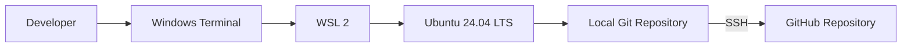
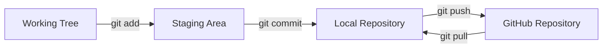

# Git Project 1: Git and GitHub Workflow with WSL 2

## Overview

This hands-on project demonstrates a complete foundational Git workflow from a Linux development environment on Windows. The environment uses Windows Subsystem for Linux 2 (WSL 2), Ubuntu 24.04 LTS, Git, SSH key authentication, and GitHub.

The project begins with a clean Linux environment, configures a Git identity, clones an empty GitHub repository, creates and stages a file, records the first commit, and publishes the `main` branch to GitHub. It also documents the troubleshooting and validation performed during the build.

This is a project-based training environment designed to establish the version-control foundation used in DevOps and cloud engineering. It is intentionally small so that each Git state and command can be examined directly.

## Architecture



The complete architecture, trust boundaries, and Git data flow are documented in [`docs/architecture.md`](docs/architecture.md).

## Technologies Used

- Windows Subsystem for Linux 2 (WSL 2)
- Ubuntu 24.04 LTS
- Bash and standard Linux commands
- Git 2.43.0
- GitHub
- OpenSSH with an Ed25519 key pair
- Markdown and Mermaid diagrams

## Project Objectives

- Build a Linux-based development environment on a Windows workstation.
- Verify the active Linux user, home directory, and administrative access.
- Install and configure Git with an author name, email address, and `main` as the default branch.
- Create a GitHub repository and clone it into the Linux home directory.
- Create `file.txt` by using shell output redirection.
- Observe the working tree, staging area, local repository, and remote repository as separate states.
- Create the repository's root commit with a clear commit message.
- Configure SSH key-based GitHub authentication without exposing the private key.
- Push `main` to GitHub and confirm upstream tracking.
- Document the process so another learner can reproduce and understand it.

## Repository Contents

```text
.
|-- README.md
|-- file.txt
`-- docs/
    `-- architecture.md
```

## Prerequisites

- Windows 10 version 2004 or later, or Windows 11
- A Windows account permitted to install or update WSL
- A GitHub account
- Internet access for WSL, Ubuntu packages, and GitHub
- Windows Terminal or PowerShell

The commands below assume the Linux username is `rester` and the repository is `rester2007/Git-Project-1`. Replace those values when reproducing the project under a different account.

## Phase 1: Build and Verify the Linux Environment

From an elevated PowerShell session, install or update WSL and inspect the available distributions:

```powershell
wsl --update
wsl --status
wsl --list --verbose
```

This project used WSL 2 with Ubuntu 24.04 LTS. WSL was selected because it provides a real Linux command-line environment while retaining the Windows workstation and tools. Keeping the repository inside the Linux filesystem also avoids unnecessary cross-filesystem overhead and produces Linux-native file permissions and line-ending behavior.

After opening Ubuntu, verify the current identity and location:

```bash
whoami
pwd
sudo -v
```

Expected results for this build:

```text
rester
/home/rester
```

`sudo -v` validates the user's cached administrative credentials without changing the system. A successful return with no error confirms that the account can run approved administrative commands.

Update the Ubuntu package metadata and installed packages, then install Git:

```bash
sudo apt update
sudo apt upgrade -y
sudo apt install -y git
git --version
```

The completed environment reported Git `2.43.0`.

## Phase 2: Configure Git Identity and Defaults

Configure the author information that Git will store in new commits:

```bash
git config --global user.name "rester"
git config --global user.email "rmcglown@hotmail.com"
git config --global init.defaultBranch main
git config --global core.autocrlf input
```

Review the settings and their source files:

```bash
git config --global --list
git config --list --show-origin
```

Why these settings matter:

| Setting | Purpose |
|---|---|
| `user.name` | Records the human-readable commit author. It does not authenticate to GitHub. |
| `user.email` | Records the author's email in commit metadata. It does not need to be the login credential used for GitHub. |
| `init.defaultBranch main` | Makes `main` the initial branch name for newly initialized repositories. |
| `core.autocrlf input` | Converts CRLF to LF when committing while preserving LF on checkout, which is appropriate for Linux-oriented work. |

## Phase 3: Create the Repository and First Commit

Create the empty repository named `Git-Project-1` in GitHub. Do not initialize it with a README, license, or `.gitignore` when following this exact empty-repository workflow.

Clone it over HTTPS initially and enter the working directory:

```bash
cd ~
git clone https://github.com/rester2007/Git-Project-1.git
cd Git-Project-1
pwd
```

Cloning creates the local working directory, downloads the remote repository data, names the remote `origin`, and establishes the initial relationship with GitHub.

Create the required file with output redirection:

```bash
printf '%s\n' 'new file for repository' > file.txt
cat file.txt
```

`printf` writes predictable text and a terminating newline. The `>` operator redirects that output into `file.txt`; it creates the file if it does not exist and replaces its contents if it does.

Inspect the working tree:

```bash
git status
```

At this point, `file.txt` is **untracked**. It exists in the working tree, but Git has not been instructed to include it in the next snapshot.

Stage the file and inspect the staged change:

```bash
git add file.txt
git status
git diff --cached
```

`git add` copies the selected version of the file into Git's staging area, also called the index. `git diff --cached` shows exactly what the next commit will record.

Create the root commit:

```bash
git commit -m "Add initial repository file"
```

This commit recorded one new file and became the first, or root, commit in the repository:

```text
ca38536 Add initial repository file
```

Verify the result:

```bash
git status
git log --oneline --decorate --stat -1
```

## Phase 4: Configure SSH and Publish to GitHub

Git commit identity and GitHub authentication solve different problems. The configured name and email identify the author inside Git history. SSH proves to GitHub that the workstation is authorized to access the account.

Generate a modern Ed25519 key pair:

```bash
ssh-keygen -t ed25519 -C "rmcglown@hotmail.com"
```

The command creates two related files by default:

- `~/.ssh/id_ed25519` is the **private key**. It must remain private and must never be committed or pasted into GitHub.
- `~/.ssh/id_ed25519.pub` is the **public key**. This is the key added to the GitHub account.

Display only the public key when it needs to be copied:

```bash
cat ~/.ssh/id_ed25519.pub
```

After adding the public key in **GitHub > Settings > SSH and GPG keys**, test authentication:

```bash
ssh -T git@github.com
```

The first connection can ask whether the GitHub host key should be trusted. The host fingerprint should be compared with GitHub's published fingerprints before accepting it. A successful authentication identifies the GitHub username and explains that GitHub does not provide interactive shell access; that message is expected.

Change the repository remote from HTTPS to SSH:

```bash
git remote set-url origin git@github.com:rester2007/Git-Project-1.git
git remote -v
```

Publish the branch and establish its upstream:

```bash
git push -u origin main
```

The `-u` option records `origin/main` as the upstream for the local `main` branch. Future pushes and pulls can normally use the shorter `git push` and `git pull` commands.

## Git Data Flow



The central lesson is that saving a file, staging a file, committing a file, and pushing a commit are four distinct actions:

1. The working tree contains the files being edited.
2. The staging area defines the exact content intended for the next commit.
3. A commit stores an immutable snapshot in the local repository.
4. A push transfers local commits to a remote repository such as GitHub.

## Validation

The completed project was validated with the following commands:

```bash
git status
git branch -vv
git remote -v
git log --oneline --decorate --stat -1
git rev-parse HEAD
git ls-remote origin refs/heads/main
```

Completion evidence:

| Check | Result |
|---|---|
| Local branch | `main` |
| Remote-tracking branch | `origin/main` |
| Root commit | `ca385369ea8f8ed3629f77071a9778df8e20758f` |
| Commit message | `Add initial repository file` |
| Required file | `file.txt` |
| Required content | `new file for repository` |
| Remote repository | `github.com/rester2007/Git-Project-1` |
| SSH authentication | Successful |
| Working tree after push | Clean |

`git rev-parse HEAD` prints the full identifier of the local commit. `git ls-remote origin refs/heads/main` prints the commit currently referenced by the remote `main` branch. Matching identifiers provide stronger verification than relying only on a successful-looking push message.

## Command Reference

| Command | Explanation |
|---|---|
| `pwd` | Prints the current working directory. |
| `printf ... > file.txt` | Writes output into a file, replacing existing contents. |
| `cat file.txt` | Displays the file so its contents can be verified. |
| `git status` | Reports the branch and the state of tracked, staged, modified, and untracked files. |
| `git add file.txt` | Stages the current version of `file.txt`. |
| `git diff --cached` | Shows the content staged for the next commit. |
| `git commit -m "..."` | Records the staged snapshot with a message. |
| `git log --oneline` | Shows a compact form of commit history. |
| `git remote -v` | Shows the fetch and push URLs for each remote. |
| `ssh -T git@github.com` | Tests SSH authentication to GitHub. |
| `git push -u origin main` | Publishes `main` and records its upstream branch. |
| `git branch -vv` | Shows local branches, their latest commits, and upstream relationships. |

## Troubleshooting Highlights

### The shell displayed a `>` continuation prompt

The first `ssh-keygen` attempt omitted the closing double quote after the email address:

```text
ssh-keygen -t ed25519 -C "rmcglown@hotmail.com
>
```

In Bash, `>` in this situation is the secondary prompt. It means the shell is waiting for the rest of an incomplete command, not that output is being redirected. Press `Ctrl+C` to cancel the incomplete command, then enter it again with matching quotation marks.

### Git reported that the upstream was gone

After the first local commit, `git status` reported that the branch was based on `origin/main`, but the upstream was gone. The GitHub repository was empty, so no remote `main` reference existed yet. The first successful push created it:

```bash
git push -u origin main
```

### GitHub accepted authentication but denied shell access

This message is expected:

```text
You've successfully authenticated, but GitHub does not provide shell access.
```

The test validates authentication only. GitHub's SSH endpoint supports Git operations rather than an interactive server shell.

### A commit email is not a GitHub password

`git config user.email` writes identity metadata into commits. It does not log in to GitHub. Repository access still requires an approved authentication method such as SSH.

## Security Considerations

- Never share or commit `~/.ssh/id_ed25519`; only the `.pub` file belongs in GitHub's SSH key settings.
- Use a strong passphrase on a private key and load it through `ssh-agent` to reduce repeated prompts.
- Verify GitHub's SSH host fingerprint before accepting the first connection.
- Do not place passwords or access tokens in remote URLs, shell history, documentation, or commits.
- Review staged content with `git diff --cached` before committing.
- Use `git status` before and after Git operations to catch unintended files.
- Remember that author email addresses stored in public commits can be visible to anyone who reads the history. A GitHub-provided no-reply address is an alternative when email privacy is required.

## Lessons Learned

- WSL 2 provides a practical Linux-first development workflow without replacing the Windows workstation.
- Git operates locally; GitHub is a remote collaboration and hosting service built around Git repositories.
- The working tree, staging area, local repository, and remote repository are separate states.
- A clean working tree means the current tracked content matches the checked-out commit; it does not by itself prove that the commit was pushed.
- `git add` is a deliberate selection step, not merely a required command before every commit.
- SSH authentication and commit authorship are related to the workflow but are technically independent.
- Verification should inspect branch tracking and compare local and remote commit identifiers.
- Small, descriptive commits make project history easier to review and explain.

## Future Improvements

- Create a feature branch and merge it through a pull request.
- Practice resolving a controlled merge conflict.
- Add a `.gitignore` when the project introduces generated files or local-only configuration.
- Add a GitHub Actions workflow when the repository contains code that can be linted or tested.
- Enable branch protection and required reviews when the repository becomes collaborative.
- Sign commits or tags when verified provenance becomes a project requirement.

## References

- [Install WSL](https://learn.microsoft.com/en-us/windows/wsl/install)
- [Set up a WSL development environment](https://learn.microsoft.com/en-us/windows/wsl/setup/environment)
- [Git Reference Manual](https://git-scm.com/docs)
- [Creating and managing GitHub repositories](https://docs.github.com/en/repositories/creating-and-managing-repositories)
- [Connecting to GitHub with SSH](https://docs.github.com/en/authentication/connecting-to-github-with-ssh)

## Author

**Rester McGlown Jr. — DevOps and Cloud Engineer**

- [GitHub project](https://github.com/rester2007/Git-Project-1)
- [LinkedIn](https://www.linkedin.com/in/rester-mcglown-jr)
- [Medium](https://medium.com/@rester.mcglown)
- Email: [rmcglown@hotmail.com](mailto:rmcglown@hotmail.com)
