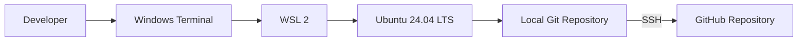
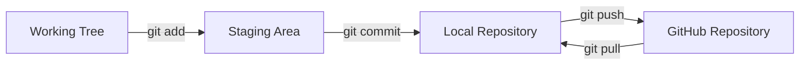

# Git Project 1: Git and GitHub Workflow with WSL 2

## Overview

This hands-on portfolio project demonstrates a complete foundational Git workflow from a Linux development environment on Windows. The environment uses Windows Subsystem for Linux 2 (WSL 2), Ubuntu 24.04 LTS, Git, SSH key authentication, and GitHub.

The project begins with a clean Linux environment, configures a Git identity, clones an empty GitHub repository, creates and stages a file, records the first commit, and publishes the `main` branch to GitHub. It also documents the validation and troubleshooting performed during the build.

This is a project-based training environment designed to practice version control, Linux command-line operations, secure GitHub authentication, and technical documentation. It is not presented as a production deployment.

## Architecture



## Technologies Used

- Windows Subsystem for Linux 2 (WSL 2)
- Ubuntu 24.04 LTS
- Bash and standard Linux commands
- Git 2.43.0
- GitHub
- OpenSSH with an Ed25519 key pair
- Markdown and Mermaid diagrams

## Project Objectives

- Build a Linux-based development environment on a Windows workstation.
- Verify the active Linux user, home directory, and administrative access.
- Install and configure Git with an author name, email address, and `main` as the default branch.
- Create and clone an empty GitHub repository.
- Create `file.txt` by using shell output redirection.
- Observe the working tree, staging area, local repository, and remote repository as separate states.
- Create the repository's root commit with a clear commit message.
- Configure SSH key-based GitHub authentication without exposing the private key.
- Push `main` to GitHub and verify that the local and remote commit identifiers match.

## Repository Contents

```text
.
|-- README.md
|-- file.txt
`-- docs/
    `-- architecture.md
```

## Phase 1: WSL 2 and Ubuntu Environment

WSL 2 was selected because the broader learning goal is DevOps and cloud engineering. It provides Linux package management, Bash behavior, permissions, paths, and tooling while retaining the Windows workstation.

From PowerShell, the WSL installation and distribution were verified:

```powershell
wsl --update
wsl --status
wsl --list --verbose
```

Inside Ubuntu, the Linux identity, working directory, and administrative access were confirmed:

```bash
whoami
pwd
sudo -v
```

The completed environment used the Linux account `rester` with the home directory `/home/rester`. Ubuntu packages were updated and Git was installed:

```bash
sudo apt update
sudo apt upgrade -y
sudo apt install -y git
git --version
```

The repository was stored under `/home/rester` instead of `/mnt/c` to preserve Linux-native filesystem behavior and avoid unnecessary cross-filesystem overhead.

## Phase 2: Git Configuration and Repository Creation

Git was configured with the commit author, email address, default branch name, and Linux-oriented line-ending behavior:

```bash
git config --global user.name "rester"
git config --global user.email "rmcglown@hotmail.com"
git config --global init.defaultBranch main
git config --global core.autocrlf input
git config --global --list
```

The author name and email are stored in commit metadata. They do not authenticate the user to GitHub.

After the empty `Git-Project-1` repository was created on GitHub, it was cloned into the Linux home directory:

```bash
cd ~
git clone https://github.com/rester2007/Git-Project-1.git
cd Git-Project-1
```

The required project file was created and verified:

```bash
printf '%s\n' 'new file for repository' > file.txt
cat file.txt
git status
```

At this stage, `file.txt` existed in the working tree but was still untracked by Git.

## Phase 3: Staging, Committing, and Publishing

The file was staged and the exact staged snapshot was reviewed:

```bash
git add file.txt
git status
git diff --cached
```

The root commit was then created:

```bash
git commit -m "Add initial repository file"
```

GitHub authentication was configured with an Ed25519 SSH key pair:

```bash
ssh-keygen -t ed25519 -C "rmcglown@hotmail.com"
cat ~/.ssh/id_ed25519.pub
ssh -T git@github.com
```

Only the public `.pub` key was added to GitHub. The private key remained in the Linux account and was never committed or shared.

The remote was changed from HTTPS to SSH, and the branch was published:

```bash
git remote set-url origin git@github.com:rester2007/Git-Project-1.git
git remote -v
git push -u origin main
```

The `-u` option established `origin/main` as the upstream branch for the local `main` branch.

## Git Data Flow



Saving a file, staging it, committing it, and pushing it are separate actions. The staging area defines the exact content that the next commit will record.

## Validation

The completed workflow was validated with:

```bash
git status
git branch -vv
git remote -v
git log --oneline --decorate --stat
git rev-parse HEAD
git ls-remote origin refs/heads/main
```

Validation confirmed:

- The local branch was `main`.
- `main` tracked `origin/main`.
- SSH authentication identified the GitHub account `rester2007`.
- `file.txt` contained `new file for repository`.
- The initial commit was `ca385369ea8f8ed3629f77071a9778df8e20758f`.
- The local and remote `main` references matched after publication.
- The working tree was clean after the push.

## Troubleshooting Highlights

- **Bash displayed a `>` continuation prompt:** The first `ssh-keygen` command contained an unmatched double quote. `Ctrl+C` cancelled the incomplete command before it was entered again with matching quotation marks.
- **Git reported that the upstream was gone:** The cloned repository was empty, so `origin/main` did not exist yet. The first `git push -u origin main` created the remote branch and established upstream tracking.
- **GitHub reported successful authentication but no shell access:** This was expected. GitHub accepts SSH for Git operations but does not provide a general interactive server shell.
- **Commit identity did not authenticate the push:** `user.name` and `user.email` identify commit authorship. SSH separately proves that the connection is authorized to access GitHub.

## Security Considerations

- Never share or commit `~/.ssh/id_ed25519`; only the public `.pub` key belongs in GitHub's SSH settings.
- Protect the private key with a passphrase and use `ssh-agent` when appropriate.
- Verify GitHub's published host-key fingerprint before accepting the first SSH connection.
- Do not place passwords, tokens, or private keys in remote URLs, shell history, documentation, or commits.
- Review staged content with `git diff --cached` before committing.
- Use `git status` before and after Git operations to identify unintended files.
- Treat the author email stored in a public commit as publicly visible metadata.

## Lessons Learned

- WSL 2 provides a practical Linux-first development workflow without replacing the Windows workstation.
- Git operates locally, while GitHub hosts and coordinates remote repository data.
- The working tree, staging area, local repository, and remote repository are separate states.
- A clean working tree does not by itself prove that the current commit was pushed.
- `git add` deliberately selects content for the next commit.
- Commit authorship and GitHub authentication solve different problems.
- Comparing local and remote commit identifiers provides stronger verification than relying only on a push message.

## Future Improvements

- Create a feature branch and merge it through a pull request.
- Practice resolving a controlled merge conflict.
- Add a `.gitignore` when the project introduces generated or local-only files.
- Add GitHub Actions when the repository contains code that can be linted or tested.
- Enable branch protection and required reviews when the repository becomes collaborative.
- Sign commits or tags when verified provenance becomes a project requirement.
