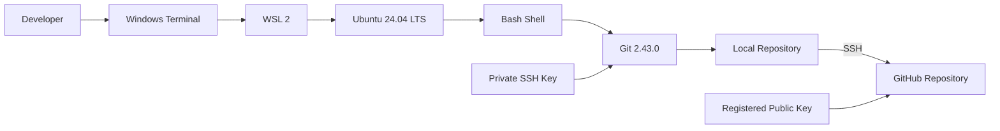
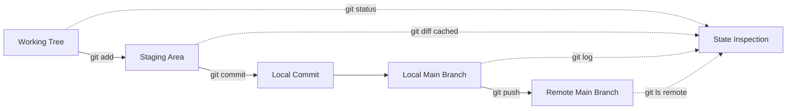
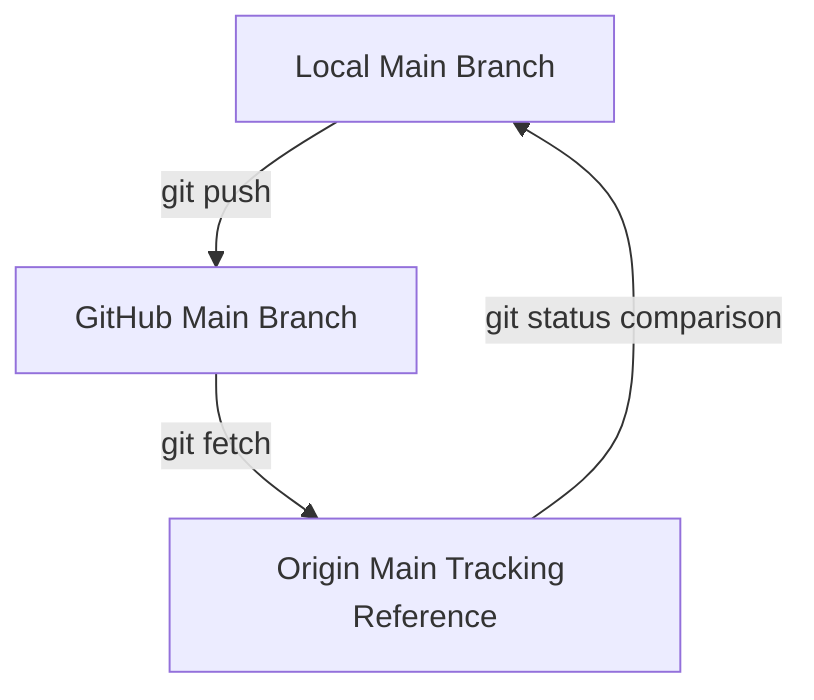

# Git Project 1 Architecture

## Purpose

This document describes the architecture of Git Project 1 at two levels:

1. The development environment that connects a Windows workstation to GitHub.
2. The Git data model that moves content from a working file to a published remote commit.

This is a version-control workflow rather than a deployed application. The architecture therefore focuses on execution boundaries, data states, authentication, and validation.

## System Context

## Component Responsibilities

| Component | Responsibility | Why it was selected |
|---|---|---|
| Windows workstation | Hosts the developer's desktop tools and WSL platform. | Preserves the existing Windows environment. |
| Windows Terminal / PowerShell | Manages WSL installation and launches the Linux environment. | Windows-side administration belongs outside the Linux distribution. |
| WSL 2 | Runs the Linux kernel and Ubuntu user space. | Provides strong Linux compatibility without a separate manually managed virtual machine. |
| Ubuntu 24.04 LTS | Supplies Bash, OpenSSH, package management, and a Linux filesystem. | Ubuntu LTS is common in development and cloud environments and receives long-term maintenance. |
| Git | Tracks file snapshots and branch history locally. | Git is the distributed version-control system being practiced. |
| OpenSSH | Authenticates Git operations to GitHub. | Avoids password-based Git operations and keeps the private credential local. |
| GitHub | Hosts the remote repository and makes the project accessible online. | Provides durable remote hosting, collaboration features, and portfolio visibility. |

## Git State Architecture

### State transitions

| Starting state | Command | Resulting state |
|---|---|---|
| File does not exist | `printf '%s\n' 'new file for repository' > file.txt` | `file.txt` exists as an untracked working-tree file. |
| Untracked working-tree file | `git add file.txt` | The file's current content is stored in the staging area. |
| Staged content | `git commit -m "Add initial repository file"` | A local root commit stores the snapshot and moves `main` to it. |
| Local commit not on GitHub | `git push -u origin main` | GitHub receives the commit, creates `origin/main`, and the local branch records its upstream. |

## Repository Relationships

`origin/main` inside the local repository is a remote-tracking reference. It is Git's locally stored record of the remote branch as of the last successful network operation. It is not a second live connection to GitHub.

## Authentication and Trust Boundary

The trust boundary is the network connection between the WSL environment and GitHub.

The SSH key pair has two different responsibilities:

- The private key stays at `~/.ssh/id_ed25519` in the Linux account and signs the authentication exchange.
- The public key stored in GitHub allows GitHub to validate that signature.

The private key is not uploaded during authentication. A passphrase protects the private key at rest, while `ssh-agent` can hold an unlocked key in memory for a login session.

The first connection also validates the server side. SSH displays GitHub's host-key fingerprint so the developer can compare it with GitHub's published fingerprint before adding it to `~/.ssh/known_hosts`.

## Data and Security Boundaries

| Data | Location | Protection requirement |
|---|---|---|
| Project files | `/home/rester/Git-Project-1` | Review changes before staging and committing. |
| Git history | `/home/rester/Git-Project-1/.git` | Do not edit internal objects manually. |
| Private SSH key | `/home/rester/.ssh/id_ed25519` | Never share, publish, or commit. Restrict filesystem access. |
| Public SSH key | GitHub account and `.pub` file | Safe to register as an authentication key; still manage intentionally. |
| Commit author email | Git commit metadata | Assume it is publicly visible in a public repository. |
| Remote repository | GitHub | Control access through the GitHub account and registered credentials. |

## Key Design Decisions

### WSL 2 instead of Git for Windows alone

Git for Windows would be sufficient for basic Git commands, but WSL 2 was selected because the broader learning goal is DevOps and cloud engineering. It provides Linux package management, Bash behavior, permissions, paths, and tooling that more closely match typical Linux cloud hosts.

### Linux home directory instead of `/mnt/c`

The repository is stored under `/home/rester`. This keeps development files on the WSL Linux filesystem, preserves Linux-native metadata, and avoids unnecessary filesystem-boundary overhead.

### SSH instead of a password in an HTTPS URL

GitHub does not accept account passwords for Git command-line authentication. SSH provides reusable public-key authentication without embedding a secret in the remote URL. HTTPS with Git Credential Manager would also be valid, but SSH aligns closely with Linux server administration skills.

### Ed25519 instead of a new DSA or legacy RSA key

Ed25519 provides a modern, compact key type supported by GitHub and OpenSSH. It was selected for a new key rather than using obsolete DSA or creating a larger legacy-style key without a compatibility need.

### Explicit staging instead of `git commit -a`

`git add file.txt` makes the staging decision visible and works for new files. `git commit -a` only stages modifications and deletions of already tracked files; it would not include the new untracked `file.txt`.

## Validation Strategy

The architecture is validated at each boundary:

1. **Environment:** `whoami`, `pwd`, `sudo -v`, and `git --version` confirm the Linux identity, filesystem location, privilege path, and tool installation.
2. **Working tree:** `cat file.txt` and `git status` confirm the required content and its Git state.
3. **Staging area:** `git diff --cached` confirms the exact snapshot selected for commit.
4. **Local history:** `git log` and `git rev-parse HEAD` confirm the commit and branch pointer.
5. **Authentication:** `ssh -T git@github.com` confirms the account-to-key relationship.
6. **Remote publication:** `git branch -vv` and `git ls-remote origin refs/heads/main` confirm upstream tracking and the remote commit identifier.

## Current Scope and Future Evolution

The current architecture intentionally uses one developer, one branch, one file, and one remote. A later project can extend the same foundation with feature branches, pull requests, protected branches, automated tests, continuous integration, release tags, and multiple contributors.
